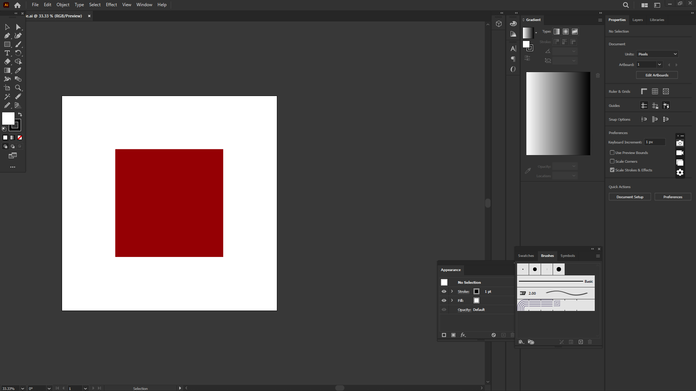
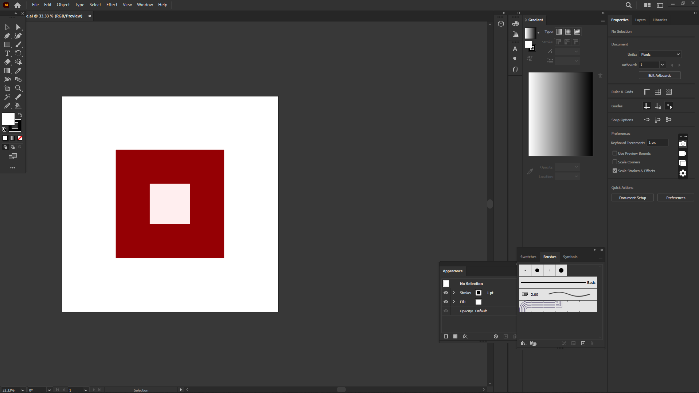

# Git Version Control Experiment with Adobe Illustrator File

## Objective
The purpose of this experiment was to understand how Git can be used to manage and track different versions of a design file efficiently. A simple Adobe Illustrator file was created and modified in two stages to demonstrate version tracking.

## Tools Used
- Git  
- GitHub  
- Adobe Illustrator  

## Experiment Description
In this experiment, two different versions of an Adobe Illustrator design file were created:

- **Version 1:** The design contained a single square.  
- **Version 2:** The design was updated to include two squares.  

Both versions were committed to the Git repository separately. Using Git commands such as viewing commit history and switching between commits, it was possible to move between earlier and later versions of the design file without losing any work.

## Visual Comparison of Versions

### Version 1 – Single Square

### Version 2 – Two Squares

## Results
The experiment successfully demonstrated how Git keeps track of design changes over time. Each modification to the Illustrator file was saved as a separate version, allowing easy comparison and recovery of previous states when required.

## Conclusion
This experiment demonstrated how Git can be used to manage different versions of project files efficiently. Two versions of an Adobe Illustrator design file were created and committed to the repository. By using Git commands such as commit history inspection and checkout, it was possible to move between earlier and later versions of the file without losing data. The experiment confirms that Git provides a reliable mechanism for tracking changes, restoring previous versions, and maintaining a structured development workflow. This makes version control especially useful for managing design iterations and ensuring project consistency over time.

## Learning Outcome
Through this experiment, the following concepts were learned:

- How Git tracks file changes across versions  
- How to commit multiple versions of a project file  
- How to view commit history  
- How to switch between previous and latest versions  
- Importance of version control in design workflows  

---

**Author:** Syed Ali Mahdi
